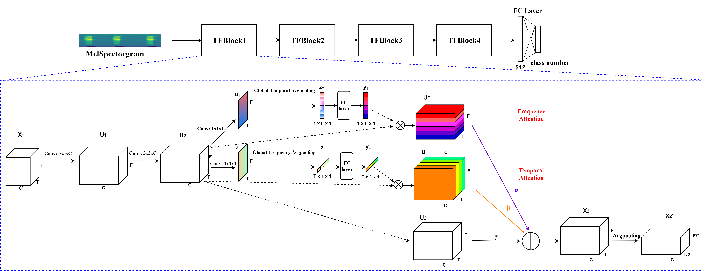

# TFNet-for-Environmental-Sound-Classification

by *Helin Wang*, *Yuexian Zou*, *Dading Chong*, *Wenwu Wang*

## Abstract
Convolutional neural networks (CNN) are one of the best-performing neural network architectures for environmental sound classification (ESC). Recently, attention mechanisms have been used in CNN to capture the useful information from the audio signal for sound classification, especially for weakly labelled data where the timing information about the acoustic events is not available in the training data, apart from the availability of sound class labels. In these methods, however, the inherent time-frequency characteristics and variations are not explicitly exploited when obtaining the deep features. In this paper, we propose a new method, called time-frequency enhancement block (TFBlock), which temporal attention and frequency attention are employed to enhance the features from relevant frames and frequency bands. Compared with other attention mechanisms, in our method, parallel branches are constructed which allow the temporal and frequency features to be attended respectively in order to mitigate interference from the sections where no sound events happened in the acoustic environments. The experiments on three benchmark ESC datasets show that our method improves the classification performance and also exhibits robustness to noise.

## Introduction
This repository is for the ICME 2020 paper (submitted), '[Learning discriminative and robust time-frequency representations for environmental sound classification](https://arxiv.org/pdf/1912.06808.pdf)'.

## Our network

